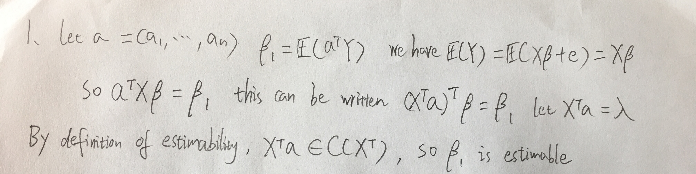
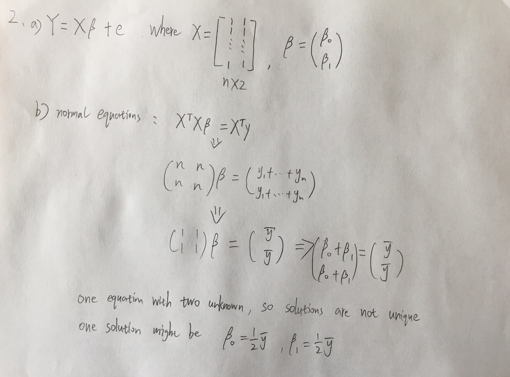
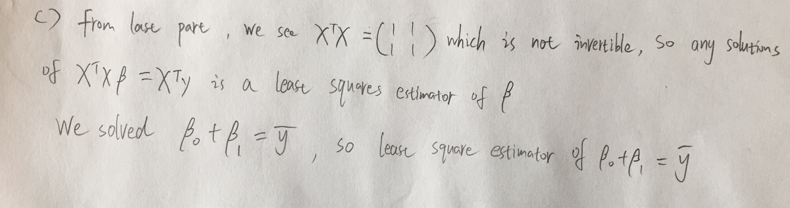
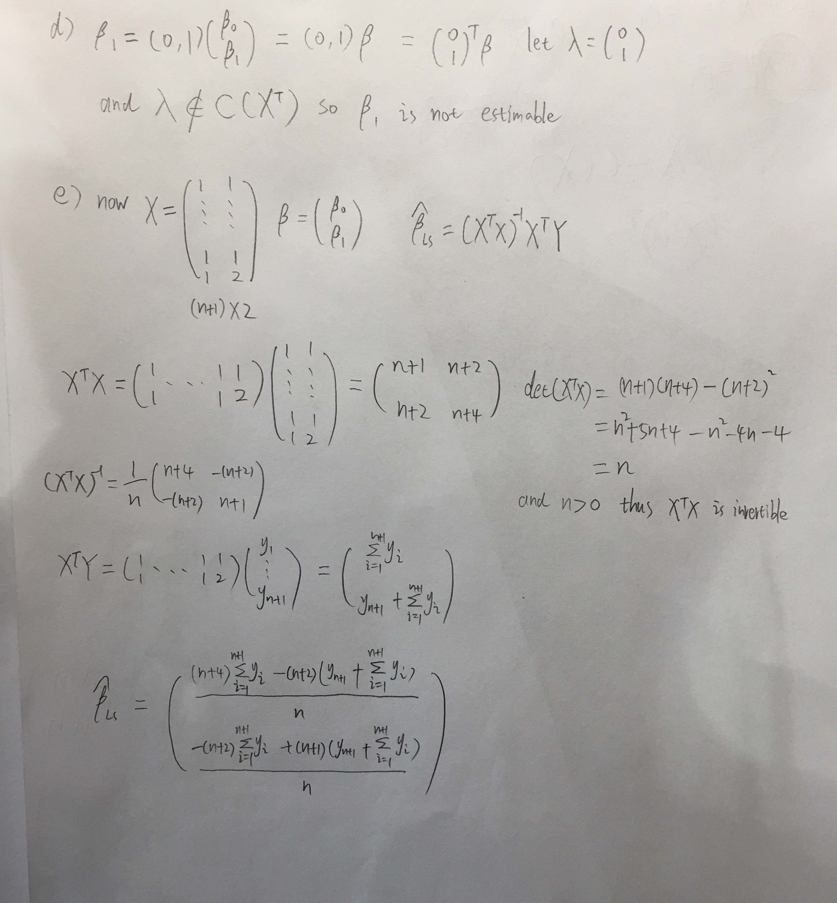
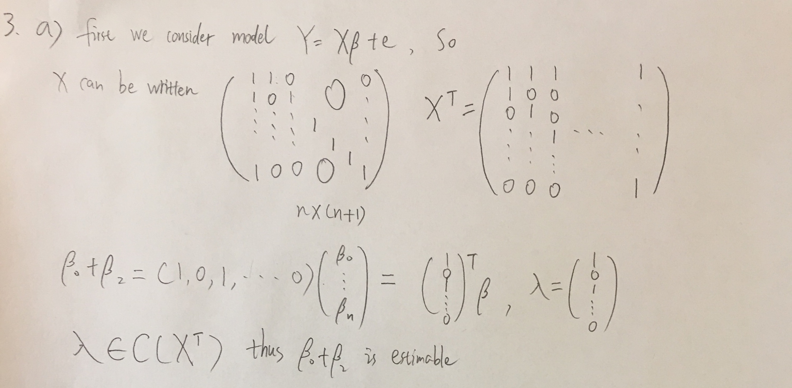
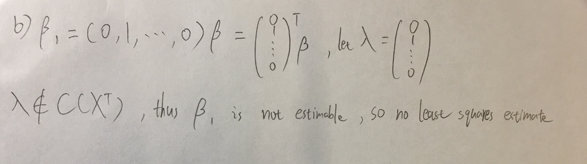
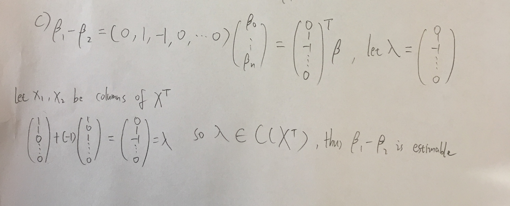
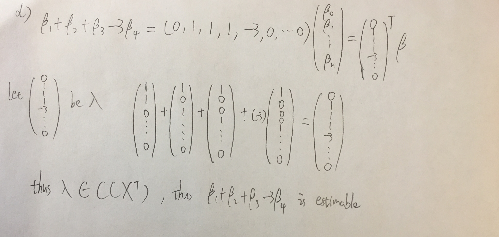
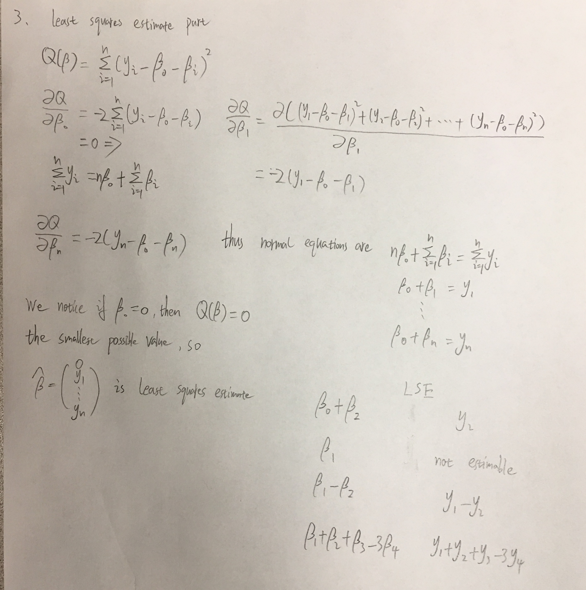
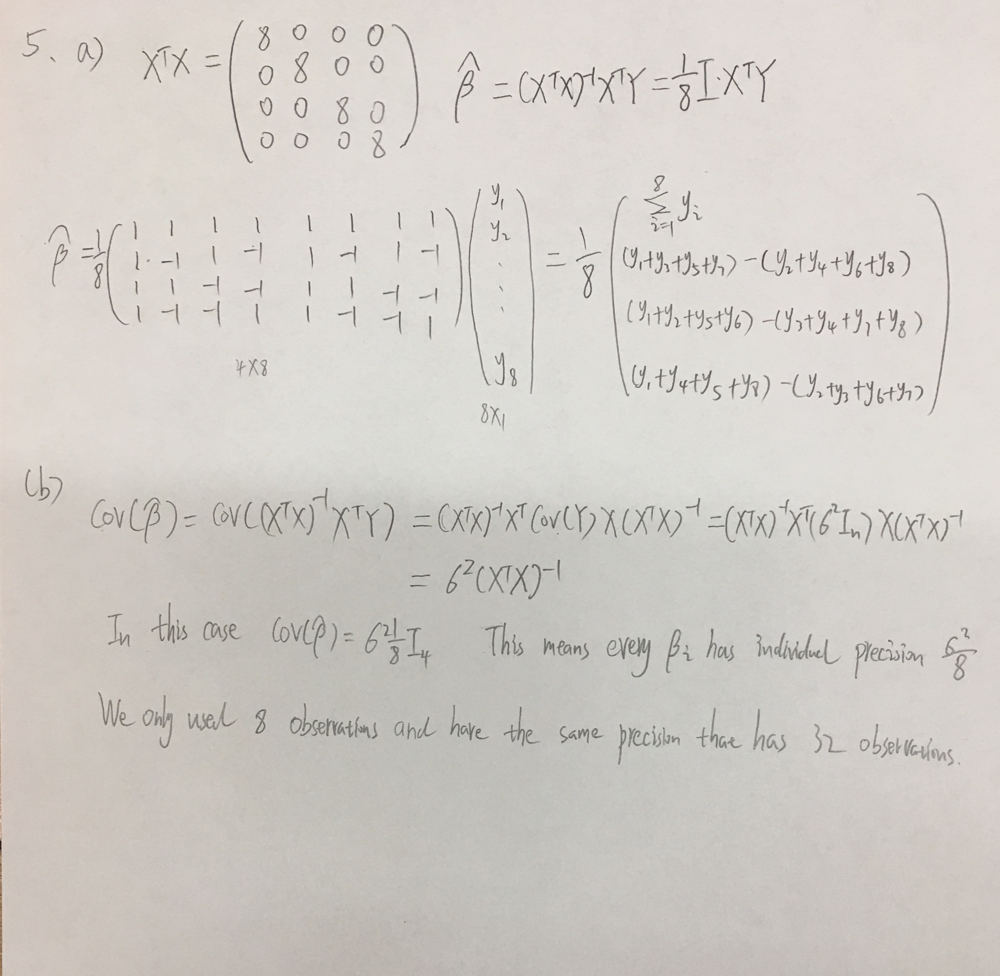

```{r setup, include=FALSE}
knitr::opts_chunk$set(echo = TRUE)

library(pracma)
# Provides a large number of functions from numerical analysis and linear algebra, numerical optimization, differential equations, time series, plus some well-known special mathematical functions. Uses 'MATLAB' function names where appropriate to simplify porting.
```
###Problem 1


###Problem 2
a and b

c


d and e


###Problem 3
a)


b)


c)


d)



lease squares estimates


###Problem 4
###a)
#####First estimate
```{r}
body = read.csv("Bodyfat.csv")

xmat = matrix(0, nrow(body), 5)
xmat[,1] = rep(1, nrow(body))
xmat[,2] = body$Age
xmat[,3] = body$Weight
xmat[,4] = body$Height
xmat[,5] = body$Age + 10*body$Weight + 3*body$Height


lmod1 = lm(bodyfat ~ Age + Weight + Height + I(Age + 10*Weight + 3*Height), data = body)
summary(lmod1)$coefficients
lmod2 = lm(bodyfat ~ Age + Weight + Height + Wrist, data = body)
lmod3 = lm(bodyfat ~ Age, data = body)

```
using `lm` function to get least squares esitmates
BODYFAT $= 17.7673848 + 0.1697902Age + 0.1981519Weight -0.5943339Height$

#####Second estimate
svd
```{r}
pseudo_inverse = pinv(xmat)
# these are least square estimates from beta0 to beta4
esti = pseudo_inverse %*% body$bodyfat;esti
```
#####Third estimates
```{r}
#we notice that the matrix X's rank is 4, because the last column is the linear combination of the previous columns.
Rank(xmat)

#find the vector that spans the nullspace of X
x5 = nullspace(xmat)
#Then this vector is orthogonal to row space of X
#A new least square estimate could be 
esti + x5
```
####b)
$$\text{x5 is the vector that spans nullspace of X and is orthogonal to row space of X }\\ \beta_1 =\lambda^T\beta= (0,1,0,0,0)\beta $$ $$ so\ \lambda=
    \begin{pmatrix}
    0\\
    1\\
    0\\
    0\\
    0
    \end{pmatrix} and\ \  \lambda \cdot x5 = -0.0949158,\text{ which is not equal to 0}
$$
$$\text{This means that}\ \lambda\ \text{is not in the row space of X, so }\beta_1 \text{ is not estimable}  $$

####c)
$$\text{we assume the model to be }\\BodyFat = \beta_0 +\beta_1 Age +\beta_2Weight+\beta_3Height+\beta_4(Age+10*Weight+3*Height)\\
\text{but we can rewrite it as }\\
BodyFat = \beta_0 +(\beta_1+\beta_4) Age + (\beta_2+10\beta_4)Weight+(\beta_3+3\beta_4)Height\\
\text{From part a, we know these results }\\ 
\text{So least sqaures estimates }\\\beta_0 = 17.7673848\\ \beta_1+\beta_4 = 0.1697902
\\\beta_2+10\beta_4 = 0.1981519 \\ \beta_3+3\beta_4 = -0.5943339
$$

####d)
Yes, we can just read off estimates from part c
```{r}
summary(lm(bodyfat ~ Age + Weight + Height + I(Age + 10*Weight +
3*Height), data = body))
```
We found that if a column is a linear combination of the other columns, lm function ignores that column.

###Problem 5



