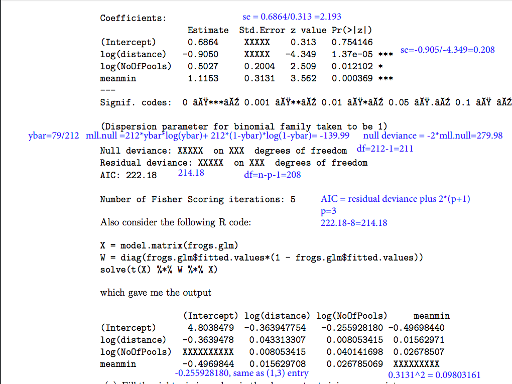
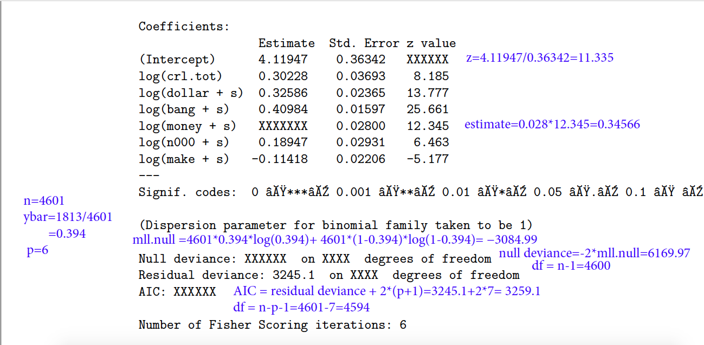

```{r setup, include = FALSE}
knitr::opts_chunk$set(echo = TRUE)
library("model4you")
library(ggplot2)
library(faraway)
library(leaps)
library(car)
#check skewness
library(e1071)
library(stringr)
library(zoo)
```

###Problem 1
```{r}
test = read.csv("test.csv")
test$Pclass = as.factor(test$Pclass)
train = read.csv("train.csv")
train$Pclass = as.factor(train$Pclass)
summary(train$Age)
```
We notice that Age has 177 missing values. So we have to fill in these missing values. We'd like to replace them with average Age. But we divided data into several groups. People with the "Miss." title are ususally young. So we replace their missing Age by the average Age of the people with "Miss." title. Etc.

```{r}
#average age for "Miss."
age1 = mean(train[grep("Miss",train$Name),]$Age,na.rm = TRUE)
#average age for "Mrs."
age2 = mean(train[grep("Mrs",train$Name),]$Age,na.rm=TRUE)
#average age for "Master."
age3 = mean(train[grep("Master",train$Name),]$Age,na.rm = TRUE)
#average age for "Mr."
age4 = mean(train[grep("Mr",train$Name),]$Age,na.rm = TRUE)

train$Age[grep("Miss",train$Name)]= age1
train$Age[grep("Mrs",train$Name)]= age2
train$Age[grep("Master",train$Name)]= age3
train$Age[grep("Mr",train$Name)]= age4
train$Age[grep("Dr",train$Name)] = age4
summary(train$Age)
train$Title = "Other"
train$Title[grep("Miss",train$Name)]="Miss"
train$Title[grep("Mrs",train$Name)]="Mrs"
train$Title[grep("Master",train$Name)]="Master"
train$Title[grep("Mr",train$Name)]= "Mr"
```

```{r}
#average age for "Miss."
age1 = mean(test[grep("Miss",test$Name),]$Age,na.rm = TRUE)
#average age for "Mrs."
age2 = mean(test[grep("Mrs",test$Name),]$Age,na.rm=TRUE)
#average age for "Master."
age3 = mean(test[grep("Master",test$Name),]$Age,na.rm = TRUE)
#average age for "Mr."
age4 = mean(test[grep("Mr",test$Name),]$Age,na.rm = TRUE)

test$Age[grep("Miss",test$Name)]= age1
test$Age[grep("Mrs",test$Name)]= age2
test$Age[grep("Master",test$Name)]= age3
test$Age[grep("Mr",test$Name)]= age4
test$Age[grep("Ms",test$Name)]= age1
summary(test$Age)

test$Title = "Other"
test$Title[grep("Miss",test$Name)]="Miss"
test$Title[grep("Mrs",test$Name)]="Mrs"
test$Title[grep("Master",test$Name)]="Master"
test$Title[grep("Mr",test$Name)]= "Mr"

test$Fare[which(is.na(test$Fare))] = mean(test$Fare, na.rm = TRUE)
```


```{r}
formula = "Survived ~ Title + Pclass + Sex + Age + Fare + SibSp + Parch"
model = glm(formula, family = "binomial", data=train)

rs =summary(regsubsets(Survived ~ Title + Pclass + Sex + Age + Fare + SibSp + Parch+Embarked,data=train))

fit = predict(model,test,type = 'response')

sur = rep(2, 418)
for (i in 1:418) {
  if (fit[i] > 0.6){
    sur[i] = 1
  }else{
    sur[i] = 0
  }
}
test$Survived = sur
write.csv(test[c("PassengerId","Survived")],file = "submmision.csv",row.names = FALSE)
```
Adding a title feature gives a 0.79425 accuracy


###Problem 2
\[\text{For logistic regression, we estimate }\beta_i\; \text{by maximize the log likelihood }\ell(\beta)\\
\text{and its gradient is given by }\nabla \ell(\beta) = X^T(Y-\hat{p})\\
\text{in order to maximize the log likelihood, we let }\nabla\ell(\beta)=0\\
X^T(Y-\hat{p})=0\;,\text{this means }Y-\hat{p} \text{ is orthogonal to the row of }X^T,\\ \text{which is also the column of X}
\]

###Problem 3



b)
plug in data we get
\[
p_i=\frac{e^{\beta_0+X\beta}}{1+e^{\beta_0+X\beta}}=0.7646\\
\]

c)
the null deviance won't get affected, because it has not involved any explanatory variables  
the residual deviance could increase or decrease, because it is related to AIC, which could increase or decrease when we add more parameters.

###Problem 4  
a)

\[
\nabla \ell(\beta) = X^T(Y-\hat{p})=0
\]
b)

\[
\hat{p} =\frac{e^{\hat{\beta_0}+X\hat{\beta}}}{1+e^{\hat{\beta_0}+X\hat{\beta}}}
\]
c)

\[
Y-\hat{p} \text{ is orthogonal to column of }X\\
X \text{ has 1 as its first column, so}\\
\sum_{i=1}^ny_i-\hat{p_i}=0\\
\text{the number of }y_i\text{ that are equal to 1}\\
\sum_{i=1}^ny_i=\sum_{i=i}^n\hat{p_i}
\]
d)

\[
\text{residual deviance }=-2*\sum_{i=1}^n [y_i\cdot log(\hat{p_i}) +(1-y_i)\cdot log(1-\hat{p_i})]
\]

###Problem 5


b)
plug in data we get
\[\beta_0+X\beta=4.11947+0.30228*log(157) +0.32586*log(0.868+0.001)+\\
0.40984*log(2.894+0.001)=6.037771 \\[0.15in]
p_i=\frac{e^{(\beta_0+X\beta)}}{1+e^{(\beta_0+X\beta)}}=\frac{e^{(6.037771)}}{1+e^{(6.037771)}}=0.9976188
\]

c)
I would use M1, since AIC is smaller for M1 than M2. Perhaps the original data are skewed, so taking logarithms transformation is better.
