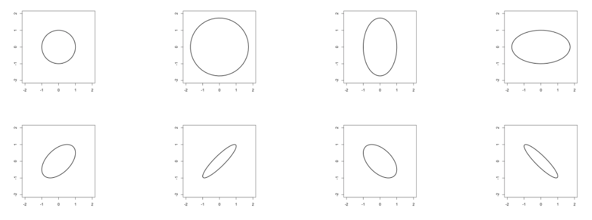

```{r setup, include = FALSE}
knitr::opts_chunk$set(
  cache=TRUE, warning=FALSE, error=FALSE, message=FALSE, echo=TRUE, 
  results = 'markup', dev='png', dpi=150
)
```
# Mahalanobis distance
Let $S$ be a symmetric positive definite matrix. Then we can define a metric (a.k.a. a distance) between two vectors $u$ and $v$ as 
\begin{align}
\|u - v\|_S = \sqrt{u^T S^{-1} v}
\end{align}
Check that this is a metric: i.e., we must check that 

1. Non-negativity: $\|u - v\|_S \geq 0$, and $\|u - v\|_S = 0$ if and only if $u = v$. 
2. Symmetry: $\|u - v\|_S = \|v - u\|_S$. 
3. Triangle inequality: $\|u - v\|_S \leq \|v - z\|_S + |z - v\|_S$. 

Some special cases: 

* If $S = I_n$, then 
\begin{align}
\sqrt{v^\top v} = \sqrt{v_1^2 + \cdots + v_n^2} = \|v\|.
\end{align}

* If $S$ is diagonal with entries $s_1, ..., s_n$, then 
\begin{align}
\sqrt{\frac{v_1^2}{s_1} + \cdots + \frac{v_n^2}{s_n}}.
\end{align}

Consider the following possibilities for $S$: 
\begin{align}
\begin{bmatrix}
1 \\ & 1
\end{bmatrix},
\begin{bmatrix}
2 \\ & 2
\end{bmatrix},
\begin{bmatrix}
1 \\ & 2
\end{bmatrix},
\begin{bmatrix}
2 \\ & 1
\end{bmatrix},
\begin{bmatrix}
1 & 0.1 \\ 0.1 & 1
\end{bmatrix},
\begin{bmatrix}
1 & 0.5 \\ 0.5 & 1
\end{bmatrix},
\begin{bmatrix}
1 & -0.1 \\ -0.1 & 1
\end{bmatrix},
\begin{bmatrix}
1 & -0.5 \\ -0.5 & 1
\end{bmatrix}
\end{align}

The contours of constant distance [from the origin] appear as follows.



How does this relate to us?


### Mahalanobis distance and linear regression
Define 
\begin{align}
S := \frac{1}{n-1} \sum_{j=1}^n (x_j - \overline{x})(x_j - \overline{x})^\top
= \frac{1}{n-1} (X^*)^\top (X^*)
\end{align}
where $x_j$ here denotes the $j$th *row* of $X$, that is the observations for the $j$th subject. 

Here, $X^*$ denotes the *non-intercept columns* of the design matrix with each column centered about its mean. 

The Mahalanobis distance to the global mean for the $i$th observation in the design matrix $X$ is then 
\begin{align}
\sqrt{(x_i - \overline{x})^\top S^{-1} (x_i - \overline{x})},
\end{align}

Why does the covariance matrix make a good metric in the regression set-up?

Intuitively, we expect that points with large Mahalanobis distance from the centroid $\overline{x}$ to have large leverage, or influence, on the regression line. The following fact makes this clear: 
\begin{align}
\underbrace{(x_i - \overline{x})^\top S^{-1} (x_i - \overline{x})}_{\Gamma_i} = (n - 1) (h_i - \frac{1}{n})
\end{align}

Re-arranging, 
\begin{align}
h_i = \frac{1}{n} + \underbrace{(x_i - \overline{x})^\top [(X^*)^\top (X^*)]^{-1} (x_i - \overline{x})}_{\frac{1}{n-1} \Gamma_i}
\end{align}

### Duncan prestige data

The data contains a "prestige" score, and we will regress "prestige" on two other covariates: education and income.  

```{r}
library(car)
data(Duncan)

head(Duncan)
```

```{r}
mod <- lm(prestige ~ income + education, data=Duncan)
X <- cbind(1, Duncan[,c("income", "education")])
X <- unname(as.matrix(X))
```

Lets consider the leverage scores: 
```{r}
# compute the hat values
H <- X %*% solve(t(X) %*% X) %*% t(X)
diag(H)
```

```{r}
lev <- diag(H)
n <- dim(Duncan)[1]
p <- 2
plot(1:n, lev)
```
Any noticeable outliers?
```{r}
# get the values with high leverage
lev.sorted <- sort(lev, decreasing=T, index.return=T)
lev.sorted$x[1:3]

rownames(Duncan)[lev.sorted$ix[1:3]]
```

```{r}
plot(1:n, lev)
for(i in lev.sorted$ix[1:3]) {
  text(i, lev[i]-0.02, rownames(Duncan)[i])
}
hbar <- (p+1)/n
abline(h=2*hbar, lty=2)
abline(h=3*hbar, lty=2)
```

Let see where this outlier lies in the cloud of $x$ values. 
```{r}
plot(Duncan$education, Duncan$income, xlim=c(-20, 120), ylim=c(-40, 120), xlab="education", ylab="income")
i = lev.sorted$ix[1]
text(Duncan$education[i]-20, Duncan$income[i], rownames(Duncan)[i], cex=0.8)
i = lev.sorted$ix[2]
text(Duncan$education[i]-20, Duncan$income[i], rownames(Duncan)[i], cex=0.8)
i = lev.sorted$ix[3]
text(Duncan$education[i]+20, Duncan$income[i], rownames(Duncan)[i], cex=0.8)
centroid <- c(mean(Duncan$education), mean(Duncan$income))
points(centroid[1], centroid[2], pch=15)
Xstar <- scale(X[,2:3], scale=F) # centering columns
A <- (t(Xstar) %*% Xstar)
ellipse(centroid, shape=A, radius=sqrt(2*hbar - 1/n), col=1, lty=2, center.cex=0)
ellipse(centroid, shape=A, radius=sqrt(3*hbar - 1/n), col=1, lty=2, center.cex=0)

```

# Residuals
Our regression model is $y = X\beta + e$. 
There are lots of $e$'s floating around these days. Lets review the ones we've talked about. 

* **unobserved residuals**: $e_i$ comes from the regression model, and these are *unobserved*. We generally put assumptions on the $e_i$s like zero-mean, homoskedastic, independent. Distributional assumptions (like normality) allow us to derive $t$ and $F$ tests. 

* **estimated residuals**: $\hat e_i$: This is our estimate for the unknown quantity $e_i$. We estimate it simply with $\hat e_i = y_i - x_i \hat\beta$. Check: if the $e_i$'s are Gaussian, what is the distribution of $\hat e_i$?

* **standardized residuals**: We compute them as 
\begin{align}
r_i := \frac{\widehat{e}_i}{\widehat{\sigma} \sqrt{1 - h_i}}
\end{align}
What does this quantity measure? Any potential drawbacks of this quantity?

* **predicted residuals**: this is the error we make predicting the $i$th observation, after running the regression on the other datapoints. Notationally, 
\begin{align}
\widehat{e}_{[i]} := y_i - x_i^\top \widehat{\beta}_{[i]},
\end{align}
where $\widehat{\beta}_{[i]}$ is computed using all but the $i$th observation. 

A nice formula allows us to derive $\widehat{e}_{[i]}$ without actually running repeated regressions. In class, it was shown that 
\begin{align}
\widehat{e}_{[i]} = \frac{\widehat{e}_i}{1 - h_i}
\end{align}

So note that if $h_i$ is large (i.e. the $i$th observation has high leverage), the predicted residual will be much larger than the estimated residual. 

Lets plot all three types of computed residuals: 
```{r}
y <- Duncan$prestige
# predicted values; 
y_hat <- H %*% y 

e_hat <- y_hat - y
plot(e_hat, title = 'estimated residuals')

e_hat_order_indx <- order(abs(e_hat), decreasing = TRUE)
i <- e_hat_order_indx[1]
text(i, e_hat[i] + 4, rownames(Duncan)[i])

i <- e_hat_order_indx[2]
text(i, e_hat[i] - 4, rownames(Duncan)[i])

i <- e_hat_order_indx[3]
text(i, e_hat[i] - 4, rownames(Duncan)[i])

```
```{r}
# standardized residuals
sigma_hat <- sqrt(sum(e_hat**2) / (n - p - 1))

e_hat_std <- e_hat / (sigma_hat * sqrt(1 - diag(H)))

plot(e_hat_std, ylab = 'standardized residual')

e_hat_std_order_indx <- order(abs(e_hat_std), decreasing = TRUE)

i <- e_hat_std_order_indx[1]
text(i, e_hat_std[i] + 0.4, rownames(Duncan)[i])

i <- e_hat_std_order_indx[2]
text(i, e_hat_std[i] - 0.4, rownames(Duncan)[i])

i <- e_hat_std_order_indx[3]
text(i, e_hat_std[i] - 0.4, rownames(Duncan)[i])

```


```{r}
# Predicted residuals
e_hat_pred <- e_hat / (1 - diag(H))

plot(e_hat_pred, ylab = 'predicted residual')

e_hat_pred_order_indx <- order(abs(e_hat_pred), decreasing = TRUE)

i <- e_hat_pred_order_indx[1]
text(i, e_hat_pred[i] + 5, rownames(Duncan)[i])

i <- e_hat_pred_order_indx[2]
text(i, e_hat_pred[i] - 5, rownames(Duncan)[i])

i <- e_hat_pred_order_indx[3]
text(i, e_hat_pred[i] - 5, rownames(Duncan)[i])

```